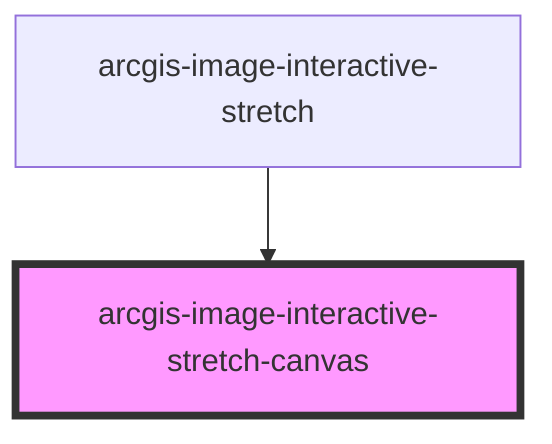

# arcgis-image-interactive-stretch-canvas

<!-- Auto Generated Below -->

## Properties

| Property                 | Attribute                  | Description | Type      | Default     |
| ------------------------ | -------------------------- | ----------- | --------- | ----------- |
| `IDNumber`               | `i-d-number`               |             | `number`  | `undefined` |
| `canvasHeight`           | `canvas-height`            |             | `number`  | `undefined` |
| `canvasWidth`            | `canvas-width`             |             | `number`  | `undefined` |
| `cursorX`                | `cursor-x`                 |             | `number`  | `undefined` |
| `leftIndex`              | `left-index`               |             | `number`  | `undefined` |
| `leftLineX`              | `left-line-x`              |             | `number`  | `undefined` |
| `mergeBars`              | `merge-bars`               |             | `boolean` | `true`      |
| `multipleHistograms`     | `multiple-histograms`      |             | `boolean` | `undefined` |
| `rightIndex`             | `right-index`              |             | `number`  | `undefined` |
| `rightLineX`             | `right-line-x`             |             | `number`  | `undefined` |
| `stretchHistogramHeight` | `stretch-histogram-height` |             | `boolean` | `true`      |

## Events

| Event           | Description | Type                    |
| --------------- | ----------- | ----------------------- |
| `cursorChanged` |             | `CustomEvent<number[]>` |
| `lineChanged`   |             | `CustomEvent<number[]>` |

## Dependencies

### Used by

 - [arcgis-image-interactive-stretch](..)

### Graph

----------------------------------------------

*Built with [StencilJS](https://stenciljs.com/)*
