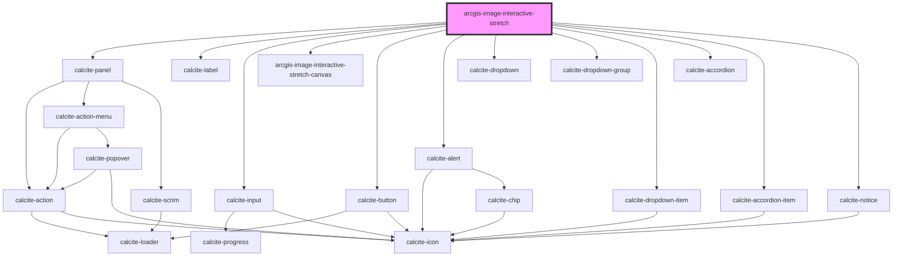

# arcgis-image-interactive-stretch

<!-- Auto Generated Below -->

## Properties

| Property             | Attribute             | Description | Type      | Default |
| -------------------- | --------------------- | ----------- | --------- | ------- |
| `multipleHistograms` | `multiple-histograms` |             | `boolean` | `false` |
| `saveCancel`         | `save-cancel`         |             | `boolean` | `true`  |

## Dependencies

### Depends on

- calcite-panel
- calcite-label
- calcite-input
- [arcgis-image-interactive-stretch-canvas](arcgis-image-interactive-stretch-canvas)
- calcite-button
- calcite-alert
- calcite-dropdown
- calcite-dropdown-group
- calcite-dropdown-item
- calcite-accordion
- calcite-accordion-item
- calcite-notice

### Graph

----------------------------------------------

*Built with [StencilJS](https://stenciljs.com/)*
